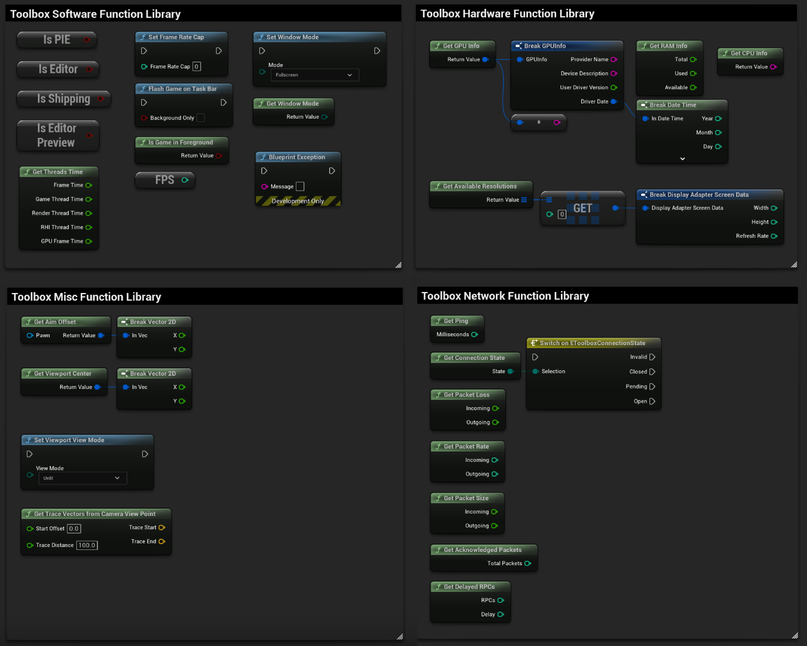

# Toolbox

Toolbox is an Unreal Engine plugin that adds Blueprint utilities for hardware information, performance, networking, gameplay, and asynchronous actions.

### Screenshots

### Installation

Get `Toolbox.zip` from the [releases](https://github.com/Solessfir/Toolbox/releases) and extract it into your project's `Plugins` folder.

### Features

- **Hardware and input:** CPU, GPU, and RAM information, available display resolutions, and gamepad detection.
- **Performance and runtime:** FPS, frame rate caps, thread and GPU timings, and editor/build checks.
- **Network statistics:** Ping, connection state, packet loss, packet rates and sizes, and delayed RPCs.
- **Viewport and window utilities:** Actor screen bounds, viewport center, view modes, window modes, and mouse cursor control.
- **Gameplay helpers:** Aim offsets, camera trace vectors, orbital transforms, and smooth interpolation between attachment sockets.
- **Async traces:** Line, sphere, capsule, and box queries by channel, profile, or object type, with Single, Multi, and Test modes and cancellation.
- **Debugging tools:** Message logs, editor notifications, and Blueprint exceptions.

## License

Licensed under the [MIT License](LICENSE).
